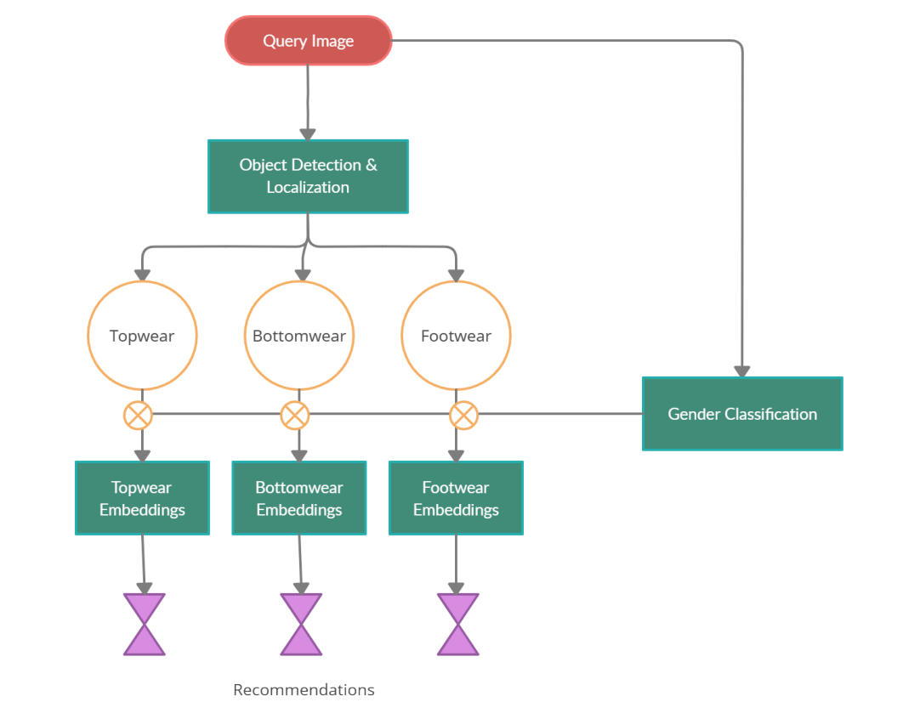
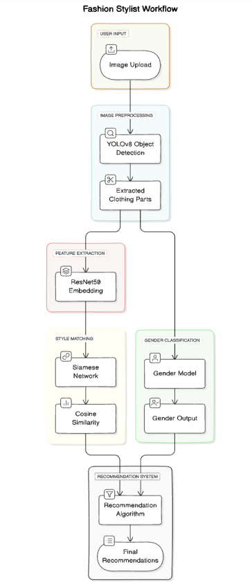

# Fashion Stylist

 Welcome to the Fashion Stylist!  
This is a web application developed as a final degree project.  
It's an application that recommends clothing and assists users in making purchases based on their personal style, powered by deep learning algorithms.

---

## Collaborators

[Omer Or](https://github.com/OmerOr1)

[Anael Nahon](https://github.com/anaeln)

[Shahar Gutman](https://github.com/ShaharGutmanCoding)

[Shalom Borohov](https://github.com/Shalom-Borohov)

---

## Table of Contents

- [Presentation Video](#Presentation-Video)
- [Features](#features)
- [Libraries and Technologies](#Libraries-and-Technologies)
- [Recommendation Algorithms](#Recommendation-Algorithms)
- [Image Credits](#Image-Credits)
- [Project Assets](#Project-Assets)

---

## Presentation Video

[Watch the Presentation](./fashion-stylist-server/public/final-presentation.mp4)

---

## Features

Fashion Stylist provides the following features:
1) Image Upload & Outfit Recommendations – Upload a picture to receive outfit suggestions.
2) Explore Item – Click 'Open' to access the product page for more details.
3) Favorites List – Save your favorite clothing items for future purchases.
4) User Profiles – Track your style history and recommendations.
5) Accessibility Toolbar – Adjust zoom, font size, contrast, and cursor options to enhance usability.

---

## Libraries and Technologies

This project is built with the following technologies:

* Python
* JavaScript (React)
* HTML/CSS
* Flask
* Node
* Pandas
* NumPy
* PyTorch
* TensorFlow
* MongoDB
* Axios
* MUI (Material-UI)
* Selenium
* Jupyter Notebook

---

## Recommendation Algorithms

* Clothing Item Extraction: To recommend relevant fashion items, we
first needed to extract specific clothing categories (shirt, pants, shoes)
from user-uploaded images. This was done using the YOLOv8 model
for real-time object detection.
* Gender Classification Model: To further personalize the
recommendations, we built a custom gender classification model. This
model predicts the user's gender based on their uploaded image and
recommends clothing items accordingly
* Image Processing: Each uploaded image was passed through a
pre-trained ResNet deep learning model to extract style features and
generate a 2048-dimensional vector (embedding).
* Similarity Matching: The cosine similarity between the user’s style
embedding and the clothing item embeddings in the database was
computed. Items with the highest similarity scores were recommended.

---

## Image Credits

* All recommended images come from [Terminal X](https://www.terminalx.com)

---

## Project Assets

* Datasets url - https://drive.google.com/drive/folders/1fXwX-Lruupt6B2X2OSBNwXWN4LX53C6f?usp=sharing
* gender classification model weights - https://drive.google.com/drive/folders/1nZGh3O8z5391Y3NWcFCQWf6TU0fJuGpw?usp=sharing
* embeddings model weights - https://drive.google.com/drive/folders/1nZGh3O8z5391Y3NWcFCQWf6TU0fJuGpw?usp=sharing

---